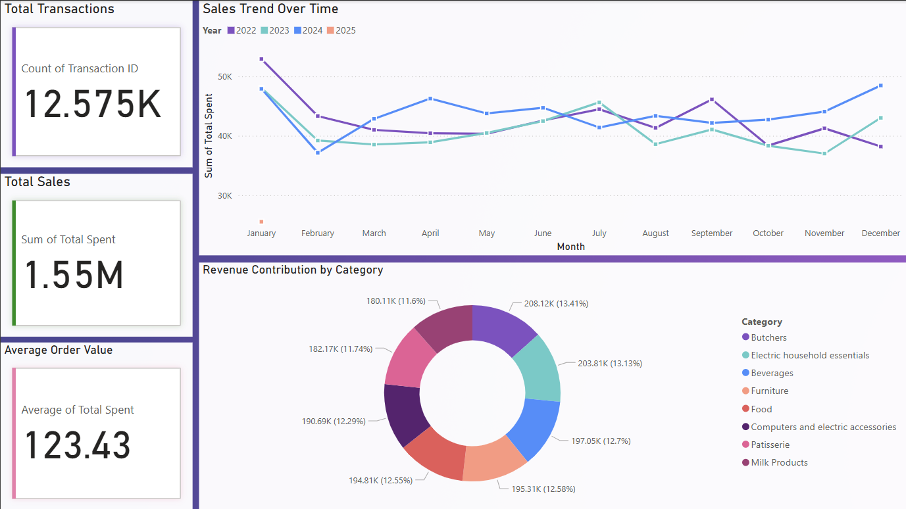
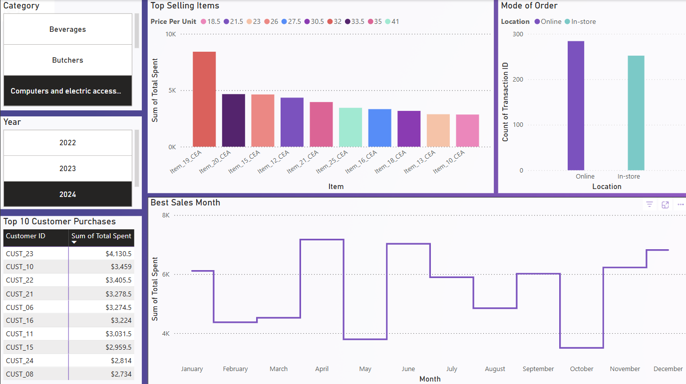
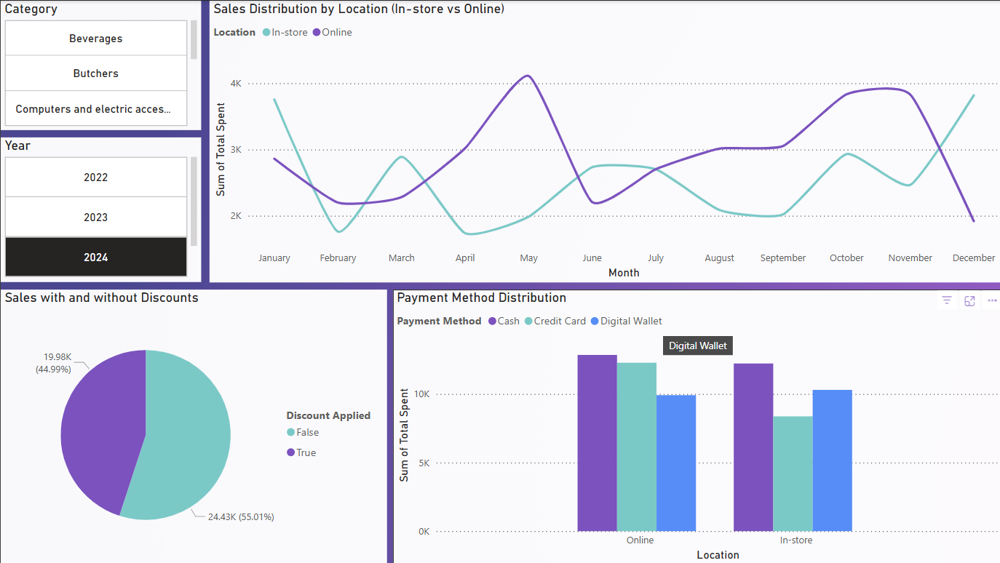

#  Retail Store Sales Analysis (Power BI) 
*by Kuzhalogi Murthy* 
## Overview
The dataset contains 12,575 sales transactions but has **missing values, inconsistencies, and "dirty" data**, making it a great test case for **data cleaning & visualization**.

## Key Insights from Analysis
### **1. Seasonality & Sales Trends**
- **January consistently records the highest revenue** across all years.
- **December also performs well**, particularly in 2023 and 2024, likely due to holiday shopping.
- **2024 had the highest overall sales**, indicating growth in transactions or pricing strategies.

### **2. Category Performance**
- The **Butchers category leads in sales**, followed closely by **Electric Household Essentials and Beverages**.
- Butchers contribute **13.58%** to total sales, slightly outperforming other top categories like **Food, Furniture, and Beverages**.

### **3. Sales Channel Distribution**
- **Online purchases slightly surpass in-store transactions**, showing a preference for digital shopping.
- **Online purchases are mostly paid in cash**, followed by **credit card and then digital wallets**.

### **4. Impact of Discounts**
- **No discounts were applied in this dataset, meaning total revenue remains unaffected by discounts.**
- However, **a significant portion of purchases still had discounts**, suggesting that discounts were recorded but not influencing final revenue.

### **5. Customer & Product Insights**
- **Top 10 customers** include **Customer 24, 08, 05, 16, 13, 23, down to Customer 02**.
- **Top revenue-generating products** include **24_FUR, 25_EHE, 25_BUT, and 24_FUR**, indicating high-value sales contributions from Furniture, Electric Household Essentials, and Butchers.

## Power BI Dashboards
Here are the visuals I created using **Power BI**:

### 📊 Sales Overview

### 📉 Customer Spending Patterns

### 📌 Transaction Trends

---
### Checkout the visual in Power BI [Retail_sales_analysis.pbix](./Power_BI_Visuals/Retail_sales_analysis.pbix)

## Cleaning Steps & Feature Engineering
- **Handled missing values** in `Item`, `Total Spent`, `Price Per Unit`, and `Quantity`.
- **Created new features** like `Total Revenue by Customer` & `Most Frequent Products`.
- **Validated data consistency**: Ensured `Total Spent = Quantity * Price Per Unit`.

## Tools Used
- **Power BI** (for dashboards)
- **Pandas & Python** (for data cleaning)

---
### Thanks to the Dataset from Kaggle [View on Dataset](https://www.kaggle.com/datasets/ahmedmohamed2003/retail-store-sales-dirty-for-data-cleaning)

